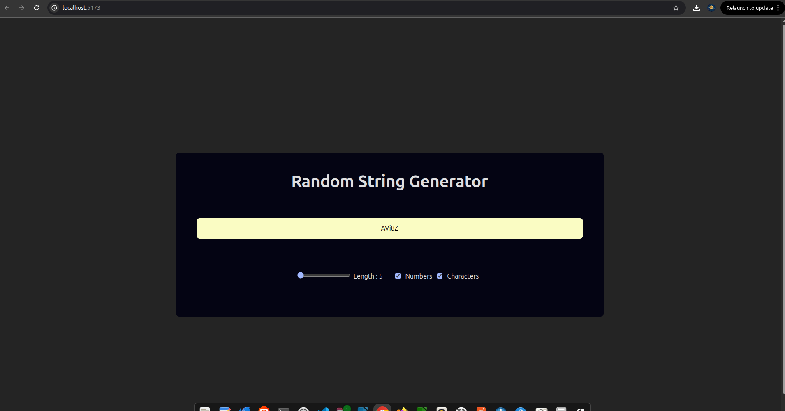
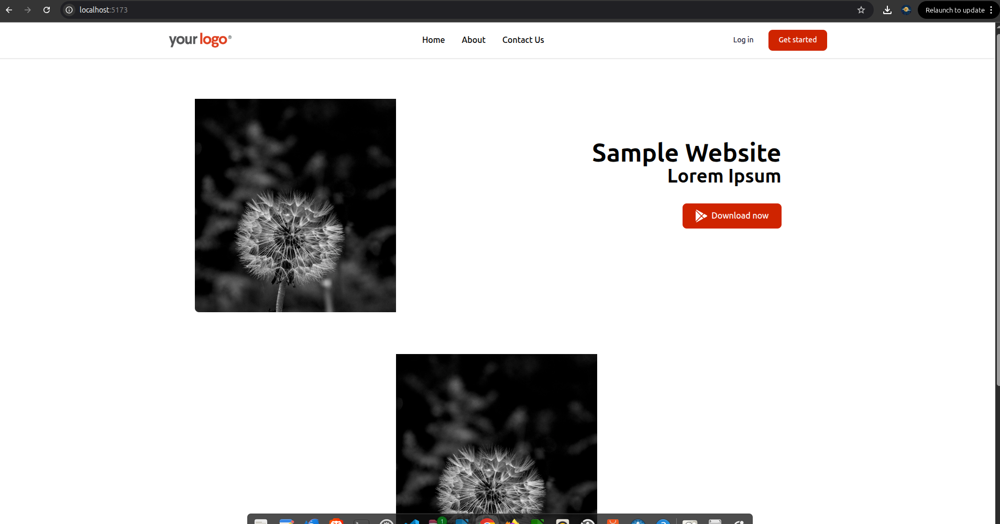
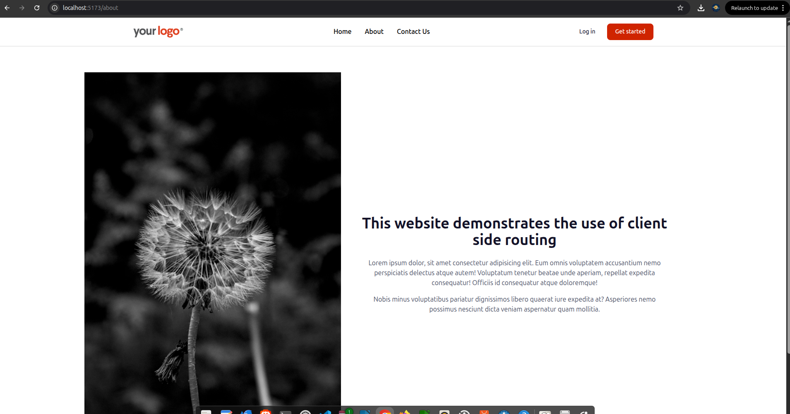
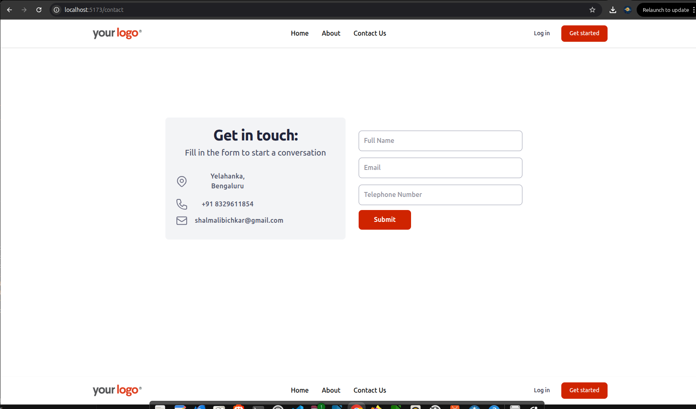

This is my submission for the codex internship. 
# Text Translator
This is a text translator which translated text from english into any language

# Random String Generator
This is a random string generator which allows user to decide length, if chars are allowed, if numbers are allowed.

# React Router
This is a Basic website having three pages - Home, About and Contact Us.This demonstrates navigation achieved using a react router.

